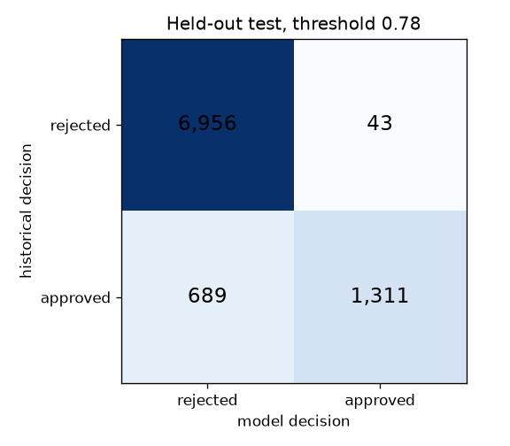
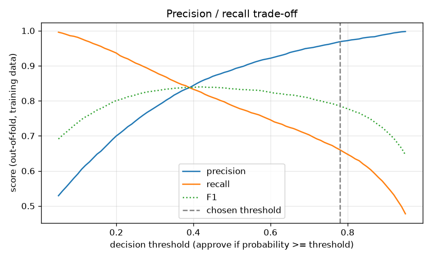

# Loan Approval Prediction

[](https://github.com/zohabaamir-ai/loan-approval-prediction-system/actions/workflows/ci.yml)

Predicting loan approval decisions on a 45,000-row dataset, ...
Predicting loan approval decisions on a 45,000-row dataset, rebuilt with an honest evaluation: scikit-learn pipelines, cross-validation on the training split only, a decision threshold tuned for a stated cost trade-off, and a held-out test split that was scored exactly once.

Built by Zohab Aamir. It started as a university machine-learning course project and was rebuilt as a portfolio project. The original notebook reported 92% accuracy from a single train/test split. This version asks what that number was hiding, and reports more than accuracy.

> **Demo only.** The dataset is synthetic and its label is a *historical decision*, not whether a borrower repaid. Nothing here is fit for real lending decisions. See [Fairness and limitations](#fairness-and-limitations).

## Results

The final model is **HistGradientBoosting without the gender feature, approving at a probability threshold of 0.78**. On the held-out test split (8,999 rows, scored once):

| Metric | Value | 95% bootstrap CI |
|---|---|---|
| ROC-AUC | 0.977 | 0.974 – 0.979 |
| Precision | 0.968 | 0.959 – 0.977 |
| Recall | 0.655 | 0.634 – 0.676 |
| F1 | 0.782 | 0.766 – 0.797 |
| Accuracy | 0.919 | 0.913 – 0.924 |

Out of 8,999 test applicants the model made 43 false approvals and 689 false rejections (confusion matrix below). In plain terms: when it says "approved" it agrees with the historical decision 96.8% of the time, but it only finds 65.5% of the applicants who were approved. That is deliberate, because the threshold was set to avoid false approvals.



### Baseline versus final

Cross-validated rows are 5-fold CV on the training split (mean ± standard deviation across folds). The final row is the held-out test split, with a 95% bootstrap confidence interval.

| Model | Evaluated on | ROC-AUC | F1 | Precision | Recall | Accuracy |
|---|---|---|---|---|---|---|
| Predict "rejected" for everyone (reference) | 5-fold CV on training data, mean ± std | 0.500 ± 0.000 | 0.000 ± 0.000 | 0.000 ± 0.000 | 0.000 ± 0.000 | 0.778 ± 0.000 |
| Rule: reject if previous default (reference) | 5-fold CV on training data, mean ± std | 0.826 ± 0.003 | 0.622 ± 0.004 | 0.451 ± 0.004 | 1.000 ± 0.000 | 0.730 ± 0.005 |
| Random Forest, all features, threshold 0.50 (baseline) | 5-fold CV on training data, mean ± std | 0.973 ± 0.002 | 0.823 ± 0.010 | 0.891 ± 0.012 | 0.766 ± 0.013 | 0.927 ± 0.004 |
| HistGradientBoosting, no gender, threshold 0.50 | 5-fold CV on training data, mean ± std | 0.977 ± 0.002 | 0.834 ± 0.010 | 0.888 ± 0.007 | 0.787 ± 0.020 | 0.930 ± 0.003 |
| **HistGradientBoosting, no gender, threshold 0.78 (final)** | **held-out test, 95% bootstrap CI** | **0.977** [0.974, 0.979] | **0.782** [0.766, 0.797] | **0.968** [0.959, 0.977] | **0.655** [0.634, 0.676] | **0.919** [0.913, 0.924] |

Two things worth noticing:

- **The tuned threshold lowers accuracy and F1 on purpose.** At 0.78 the model trades recall for precision. The ROC-AUC, which does not depend on the threshold, is unchanged from cross-validation, and the test result matches it (0.977).
- **The gain over Random Forest is small.** HistGradientBoosting had to beat the Random Forest's cross-validated ROC-AUC by more than that baseline's fold-to-fold standard deviation. It needed 0.9752 and reached 0.9772, so it was adopted under the rule fixed beforehand, but only narrowly.

### What changed from the original notebook

| | Original notebook | This rebuild |
|---|---|---|
| Evaluation | one 70/30 split, accuracy plus a report | 5-fold CV on the training split for every decision; test split scored once; ROC-AUC, precision, recall, F1, bootstrap CIs |
| Preprocessing | label-encoded before the split; features not scaled | imputing, scaling and one-hot encoding inside a scikit-learn Pipeline, fitted on training folds only |
| Accuracy by model | RF 92.5%, LR 84.2%, DT 89.7%, SVC 80.1% | RF 92.7%, LR 89.7%, DT 89.8%, SVM 91.6% (5-fold CV) |
| Class imbalance | not discussed | 77.8% of rows are "rejected", so always predicting "rejected" already scores 77.8% accuracy |
| Gender | used as a feature | excluded, with an audit by gender and age band |

Random Forest's accuracy is unchanged, so the original 92% was an honest holdout number for that setup, but it was only about 15 points above doing nothing. Logistic Regression and SVM rose most likely because the original never scaled the features.

## Quick start

Needs Python 3.11 or newer. Developed on Windows with Python 3.11, and also tested on Linux with Python 3.12.

```powershell
git clone https://github.com/zohabaamir-ai/loan-approval-prediction-system.git
cd loan-approval-prediction-system
python -m venv .venv
.\.venv\Scripts\Activate.ps1        # macOS/Linux: source .venv/bin/activate
python -m pip install -e ".[dev]"
```

**Get the data.** The dataset is not included in this repository. Follow [DATA.md](DATA.md) and save it as `data/loan_data.csv`.

**Run the tests.** They use a small synthetic sample, so they do not need the real data:

```powershell
python -m pytest -q
```

**Reproduce the results.** Run these in order. The first takes about two minutes (the SVM is slow); the others take seconds.

```powershell
python -m loan_approval.run_baseline      # 4 original models in a Pipeline, 5-fold CV
python -m loan_approval.run_candidates    # HistGradientBoosting vs the Random Forest baseline
python -m loan_approval.run_threshold     # pick the decision threshold from out-of-fold predictions
python -m loan_approval.run_final         # score the held-out test split, once
```

`run_final` refuses to run if `reports/final_test.json` already exists, because scoring the test split twice would no longer be an honest estimate. That file is committed, so a fresh clone already has it. To verify the number independently, delete `reports/final_test.json` first (restore it afterwards with `git restore reports/final_test.json`). You should get identical results. Use `python -m loan_approval.run_final --render-only` to rebuild only the figure and tables.

On Windows, always run modules as `python -m package.module` rather than through generated launcher `.exe` files, which Application Control sometimes blocks.

## Demo app

A small Gradio app: enter an applicant, get an approval probability and a decision at the 0.78 threshold. It needs the dataset, because the model is rebuilt from the data each time the app starts (a few seconds), so no pickle tied to a library version is shipped.

```powershell
python -m pip install -e ".[app]"
python -m loan_approval.app
```

Open the address it prints (usually http://127.0.0.1:7860). Gender is not asked for and not used.

## Method

1. **Clean.** Drop exact duplicates (none found) and 7 rows with an age above 100. 44,993 rows remain.
2. **Split first.** A stratified 80/20 split with a fixed seed: 35,994 training rows and 8,999 test rows. The test rows are not touched until the very end.
3. **Pipelines.** All preprocessing and the classifier live in one scikit-learn Pipeline, so cross-validation refits everything on each training fold only.
4. **Baseline.** The original four models (Random Forest, Logistic Regression, Decision Tree, SVM) with default settings, 5-fold stratified cross-validation, plus two reference points: "always rejected" and a one-line "reject if previous default" rule.
5. **One stronger model.** HistGradientBoosting without the gender feature, with default settings and no tuning. Adopted only if its mean cross-validated ROC-AUC beat the Random Forest baseline's mean plus its standard deviation. This rule was fixed before running it.
6. **Threshold.** Chosen on out-of-fold predictions on the training data, assuming a false approval costs three times a false rejection.
7. **Final test.** The frozen model and threshold are scored once on the held-out test split, with bootstrap confidence intervals (2,000 resamples) and a fairness audit.

## Fairness and limitations

**This is a synthetic dataset and a demo.** The data's description says it was generated, and several patterns below show it does not behave like real lending data. Results do not transfer to any real lender.

**The label is a past decision, not repayment.** `loan_status` is whether the application was approved in the data, not whether the borrower later repaid. A model that predicts decisions reproduces whatever process produced them, including unfair ones. "False approval" in the cost trade-off below is only a stand-in for a bad loan. Repayment outcomes cannot be measured with this data.

**Shortcuts and odd patterns.**
- Everyone with a previous default on file (about half of all rows) was rejected, with no exceptions. A one-line rule based on that alone reaches a cross-validated ROC-AUC of 0.826, so a large part of this task is that rule.
- `loan_int_rate` is the next-strongest predictor. In real lending an interest rate is often set at or after the decision, which would make it a leaky feature. This cannot be verified from the data, so it was kept as in the original project.
- The model gives high approval probabilities to larger loans at higher interest rates, the opposite of real lending logic. For example, a $20,000 loan on a $40,000 income at 15% interest is scored as very likely to be approved. This is most likely an artifact of how the data was generated.

**Sensitive features.**
- Gender is excluded from the final model. It added nothing: Random Forest's cross-validated ROC-AUC was 0.973 with it and 0.974 without it. The audit on the test split shows approval rates of 14.8% (female) and 15.3% (male), and recall of 65.2% and 65.8%.
- Age is still a model feature. The audit shows older applicants are approved less often and found less often: model approval rate is 17.3% for applicants aged 24 or under and 12.4% for ages 30–39, and recall is 70.3% for 24 or under versus 59.4% for 40 and over (a gap of 10.9 points). The 40-and-over group has only 420 test rows, so that figure is noisy.
- The data has no marital status, religion, race or similar fields, and proxies for them cannot be checked. The audit looks at a few standard gaps only. It is a check, not a certificate of fairness.

**Class balance.** 22.2% of applications were approved. Accuracy is misleading on data like this, so precision, recall, F1 and ROC-AUC are reported alongside it.

**The threshold rests on an assumption.** The 3:1 cost ratio is not derived from data. The cost-optimal thresholds for other ratios (false approval : false rejection) are 1:1 → 0.48, 2:1 → 0.69, 3:1 → 0.78, 5:1 → 0.81 and 10:1 → 0.89. Compared with the default 0.50, the 0.78 threshold cut false approvals from 795 to 171 on out-of-fold training predictions, at the cost of false rejections rising from 1,707 to 2,718.



**Statistical caveats.** One split and one seed. The confidence intervals reflect test-sample uncertainty only, not the variation you would see from different random splits. Different machines can differ in the last decimal; a Windows run and a Linux run of this project agreed to three decimals.

## Repository layout

```
src/loan_approval/    data loading, pipelines, evaluation, threshold, final scoring, fairness, app
tests/                unit tests (use synthetic data, no dataset needed)
data/                 sample_synthetic.csv (fake, for tests); put loan_data.csv here
reports/              saved results (JSON), results_table.md, figures
DATA.md               dataset source, license status, column guide
.github/workflows/    CI: ruff and pytest on every push
```

## Development

```powershell
python -m ruff check .
python -m ruff format --check .
python -m pytest -q
```

GitHub Actions runs the same three commands on every push. Versions of pandas (2.2.3) and scikit-learn (1.5.2) are pinned in `pyproject.toml`.

## Data and license

The code is released under the [MIT License](LICENSE). The dataset is not included in this repository and has its own terms; see [DATA.md](DATA.md).